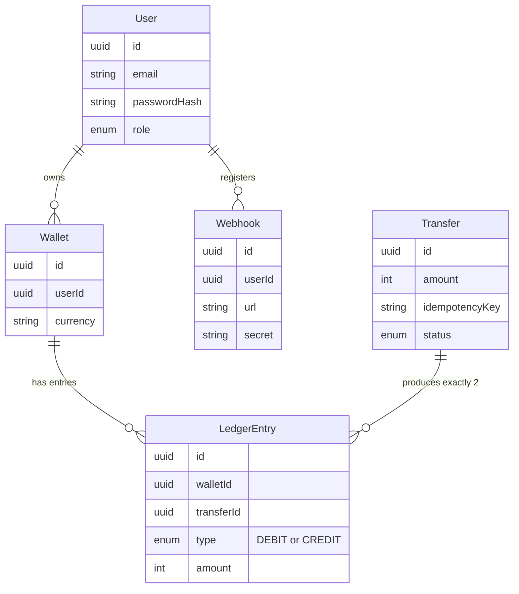

# Digital Wallet Ledger

[](https://github.com/spal45/Digital_Wallet_Ledger/actions/workflows/ci.yml)
[](https://digitalwalletledger-production.up.railway.app/docs)

A backend service for moving money between wallets, built the way real financial systems are built: an **append-only double-entry ledger**, **idempotent transfers**, and **row-level locking** to guarantee correctness under concurrent load — not a single mutable `balance` column that trusts every write to be correct.

**Live API + interactive docs:** https://digitalwalletledger-production.up.railway.app/docs

## Why this project

Most CRUD portfolio projects fake money movement with `UPDATE wallets SET balance = balance - amount`. That approach silently breaks the moment two requests touch the same wallet at once, and it leaves no audit trail of *how* a balance got to where it is. This project is built around the two properties that actually matter for a ledger:

- **A wallet's balance is never stored — it's derived.** Every transfer writes two immutable rows to a `ledger_entries` table (a debit and a matching credit). Balance is `SUM(amount)` over those rows. Nothing can silently overwrite history; the full transaction trail is always reconstructible.
- **Correctness holds under real concurrency, not just in the happy path.** An automated test fires many simultaneous transfer requests against a wallet with a fixed balance and asserts the exact number succeed, the exact number are rejected, and the wallet never goes negative — see [Concurrency correctness](#concurrency-correctness) below.

## Table of contents

- [Architecture](#architecture)
- [Tech stack](#tech-stack)
- [API reference](#api-reference)
- [Key engineering decisions](#key-engineering-decisions)
- [Getting started](#getting-started)
- [Testing](#testing)
- [Deployment](#deployment)
- [Project structure](#project-structure)

## Architecture



A transfer of ₹10 from Wallet A to Wallet B never touches a `balance` field. It creates one `Transfer` record and two `LedgerEntry` rows — `DEBIT -1000` on A, `CREDIT +1000` on B — inside a single database transaction. Query either wallet's balance at any point by summing its entries; the two sides always net to zero across the system.

## Tech stack

| Layer | Choice | Why |
|---|---|---|
| Framework | [NestJS](https://nestjs.com) 11 + TypeScript | Structured DI, modules, and guards scale better than raw Express for a multi-domain API |
| Database | PostgreSQL 16 (via [Supabase](https://supabase.com)) | Row-level locking (`SELECT ... FOR UPDATE`) and true ACID transactions are load-bearing here, not optional |
| ORM | [Prisma](https://prisma.io) 7 + `@prisma/adapter-pg` | Driver-adapter model avoids Prisma's native query engine entirely — portable, WASM-based client |
| Auth | JWT (`@nestjs/jwt`, `passport-jwt`) + `argon2` password hashing | Stateless auth, industry-standard password hashing (not bcrypt/md5) |
| Validation | `class-validator` / `class-transformer` | Declarative DTO validation, enforced globally |
| Rate limiting | `@nestjs/throttler` | Global default + a stricter per-route limit on `/auth/login` and `/auth/register` |
| API docs | `@nestjs/swagger` | Live, interactive OpenAPI docs at `/docs` |
| Testing | Jest + Supertest | Unit tests (mocked Prisma) + real e2e tests against a live Postgres |
| Containerization | Docker (multi-stage build) + Docker Compose | Identical environment locally and in production |
| CI | GitHub Actions | Lint, typecheck, unit tests, e2e tests against a service-container Postgres, and a production build on every push |
| Hosting | Railway (app) + Supabase (database) | Container-native deploy, managed Postgres |

## API reference

Full interactive documentation (with a working "Authorize" flow) is at [`/docs`](https://digitalwalletledger-production.up.railway.app/docs). Summary:

| Method | Endpoint | Auth | Description |
|---|---|---|---|
| `POST` | `/auth/register` | — | Create an account |
| `POST` | `/auth/login` | — | Exchange credentials for a JWT |
| `GET` | `/auth/me` | ✓ | Return the authenticated user |
| `POST` | `/wallets` | ✓ | Create a wallet (one per currency per user) |
| `GET` | `/wallets` | ✓ | List your wallets with computed balances (paginated) |
| `GET` | `/wallets/:id` | ✓ | Get one wallet's balance |
| `POST` | `/wallets/:id/deposit` | ✓ | Fund a wallet (idempotent) |
| `POST` | `/transfers` | ✓ | Move money between two wallets (idempotent, atomic) |
| `GET` | `/transfers` | ✓ | List transfers involving your wallets (paginated) |
| `GET` | `/transfers/:id` | ✓ | Get one transfer |
| `POST` | `/transfers/:id/reverse` | ✓ (ADMIN/SUPPORT) | Reverse a completed transfer via a new opposite-direction transfer |
| `POST` | `/webhooks` | ✓ | Register a URL to be notified on transfer completion or reversal |
| `GET` | `/webhooks` | ✓ | List your registered webhooks (paginated) |
| `DELETE` | `/webhooks/:id` | ✓ | Remove a webhook |

Routes marked ✓ require `Authorization: Bearer <token>`. `ADMIN`/`SUPPORT` roles can access any wallet or transfer; `CUSTOMER` is restricted to their own.

All three paginated list endpoints accept `?page=1&limit=20` (`limit` capped at 100) and respond with `{ data: [...], meta: { total, page, limit, totalPages } }`.

## Key engineering decisions

These are the parts of this project that came from actually hitting and solving real problems, not just following a tutorial.

**Preventing double-spend under concurrency.** `TransfersService` locks both wallets involved with `SELECT ... FOR UPDATE`, always in a fixed order (sorted by id), before reading the balance. Locking in a consistent order specifically prevents deadlocks between two transfers moving money in opposite directions between the same wallet pair. Even so, under heavy contention (many requests queuing on the same row), Postgres's multixact mechanism can report a genuine deadlock cycle — confirmed by reproducing it live. The fix, matching Postgres's own documentation, is a bounded retry on deadlock, not a redesign.

**Idempotency, including under a real race.** Every transfer and deposit carries a client-supplied `idempotencyKey`. A retried request with the same key returns the original result rather than reprocessing — verified for the sequential case and for two *simultaneous* duplicate requests racing on the database's unique constraint, where the loser catches the constraint violation and returns the winner's result instead of erroring.

**Automated proof, not a one-off demo.** [`test/transfers-concurrency.e2e-spec.ts`](test/transfers-concurrency.e2e-spec.ts) boots the real app against a real Postgres, fires 10 concurrent transfer requests against an 800-balance wallet, and asserts exactly 8 succeed, exactly 2 are rejected, every successful transfer ID is unique, and both wallets' final balances are exact. This runs on every CI push.

**Supabase's pooling modes are not interchangeable.** The app's normal queries use Supabase's Transaction pooler (many short-lived connections — right for high-concurrency API traffic). Migrations need a different guarantee: one stable session for their advisory lock. Reusing the Transaction pooler for migrations was tested directly and reliably hangs, confirming why a separate connection type is necessary. Supabase's raw "Direct connection" is IPv6-only, which silently breaks from inside Docker (containers only get outbound IPv4) — the actual fix is Supabase's **Session pooler**: IPv4-reachable, but with true single-session semantics.

**Fire-and-forget webhooks.** Webhook delivery is dispatched after a transfer commits but is never awaited by the request path — a slow or failing third-party endpoint can't add latency to, or break, the transfer itself. Delivery is signed with HMAC-SHA256 so receivers can verify authenticity independently.

**Reversal never mutates history.** `POST /transfers/:id/reverse` (ADMIN/SUPPORT only) doesn't edit or delete the original transfer's ledger entries — it creates a brand new transfer with the debit/credit flipped, and only then marks the original `REVERSED`. The append-only design that makes the ledger auditable in the first place is exactly what makes reversal safe: the full history of "money moved, then moved back" is always reconstructible, never overwritten.

**Rate limiting scoped to actual risk, not blanket throttling.** A generous global default (100 req/min) covers normal API usage, but `/auth/login` and `/auth/register` are throttled far more tightly (5 req/min) since those are the actual brute-force and spam-registration targets — verified live: 5 rapid login attempts succeed (or fail on bad credentials) normally, the 6th gets a `429` with a `Retry-After` header, and the window correctly resets after 60 seconds rather than locking the account out indefinitely.

**Deployed behind a reverse proxy? Rate limiting silently breaks without `trust proxy`.** Railway (like most PaaS hosts) terminates the real client connection at its own edge and forwards to the container, so Express's `req.ip` — what `ThrottlerGuard` keys its per-client counter on — reflects that proxy hop, not the real client, unless explicitly told to trust it. This was caught by testing against the live deployment, not just locally: the exact same rate-limit test passed on a laptop and silently did nothing in production until `app.set('trust proxy', 1)` was added.

**Stable ordering for pagination.** Every paginated query has an explicit `orderBy: { createdAt: 'desc' }` before its `skip`/`take`. Without a deterministic sort, Postgres doesn't guarantee row order across separate `LIMIT`/`OFFSET` queries — pages could silently return duplicate or missing rows as data changes between requests.

## Getting started

### Prerequisites
- Node.js 22+
- Docker Desktop (for the containerized path)
- A PostgreSQL instance (local, or Docker Compose provides one)

### Local development

```bash
npm install
cp .env.example .env   # fill in DATABASE_URL, JWT_SECRET, etc.
npm run migrate:dev
npm run start:dev
```

API available at `http://localhost:3000`, docs at `http://localhost:3000/docs`.

### With Docker Compose (app + its own Postgres)

```bash
docker compose up --build
```

This builds the image, starts a dedicated Postgres container, applies migrations automatically on boot, and runs the app at `http://localhost:3000`.

### Production-style deployment (app only, against an existing database)

```bash
cp .env.production.example .env.production   # fill in Supabase credentials
docker compose -f docker-compose.prod.yml up --build
```

## Testing

```bash
npm test              # unit tests (Prisma fully mocked)
npm run test:e2e       # e2e tests against a real local Postgres, including the concurrency proof
npm run lint            # ESLint (strict, typed rules)
```

CI runs all of the above, plus a production build, on every push — see the badge at the top of this file or [`.github/workflows/ci.yml`](.github/workflows/ci.yml).

## Deployment

- **App:** containerized via the multi-stage [`Dockerfile`](Dockerfile), deployed on [Railway](https://railway.com), built directly from this repo on every push to `main`.
- **Database:** [Supabase](https://supabase.com) Postgres. The container's entrypoint ([`docker-entrypoint.sh`](docker-entrypoint.sh)) runs `prisma migrate deploy` on every boot, so schema changes ship automatically with the next deploy.
- **Migrations locally vs. production** are deliberately separate workflows: `npm run migrate:dev` (local Postgres, generates new migration files) vs. `npm run migrate:deploy:supabase` (applies already-committed migrations to Supabase) — see [`prisma.config.ts`](prisma.config.ts).

## Project structure

```
src/
├── auth/          # Registration, login, JWT guards, RBAC (roles.guard.ts)
├── wallets/        # Wallet creation, balance queries, deposits
├── transfers/      # The core: atomic double-entry transfers with locking + idempotency
├── webhooks/        # Signed delivery notifications on transfer completion
└── prisma/         # PrismaService wired to the pg driver adapter

test/
└── transfers-concurrency.e2e-spec.ts   # The concurrency correctness proof

prisma/
├── schema.prisma    # User, Wallet, Transfer, LedgerEntry, Webhook
└── migrations/       # Versioned schema history

docs/                 # Beginner-oriented guides to NestJS/Prisma/PostgreSQL as used in this project
```

## License

UNLICENSED — personal portfolio project.
